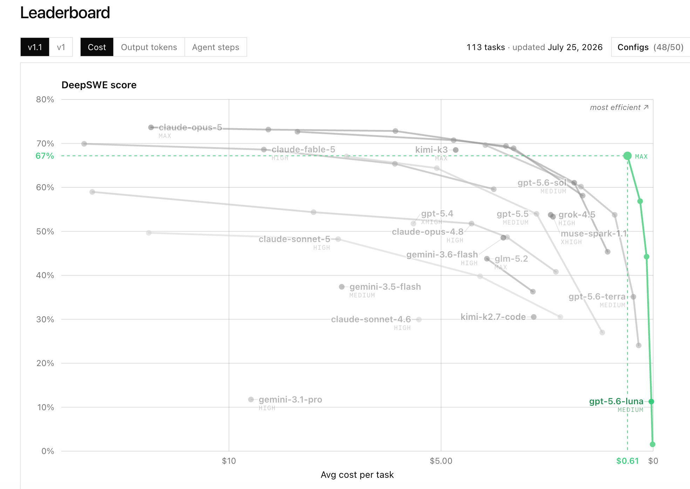

# Sol + Luna workflow for Codex

**Sol owns ambiguity. Luna Max owns bounded execution. First-principles constraints keep verification subordinate to the result.**

This repository is both a human-readable workflow and an agent-deployable package for Codex. GPT-5.6 Sol stays in the main thread to understand the objective, split work, resolve tradeoffs, review results, and integrate the final answer. A named GPT-5.6 Luna Max worker handles code review, module analysis, independent implementation, test diagnosis, and other tasks that can be expressed as a closed execution package.

[简体中文](README.md)

```text
Sol lead: objective -> boundaries -> task packet -> review -> integration
                                      |
                                      v
Luna Max worker: inspect / analyze / implement / diagnose / report
```

## Where the orchestration lives

The decomposition logic belongs to the Skill, not the worker profile. Each layer has one responsibility:

| Layer | Responsibility |
|---|---|
| [`personalization.md`](personalization.md) | Activates the preference in Codex App and tells Sol when to use the workflow |
| [`sol-luna-workflow`](skills/sol-luna-workflow/SKILL.md) | Defines Sol's decomposition test, routing decision, worker packet, write isolation, verification, review, and integration |
| [`luna-worker.toml`](agents/luna-worker.toml) | Pins the Luna Max execution lane and prevents the worker from redefining or expanding its assignment |

`SKILL.md` remains in English as the single model-facing execution contract, avoiding drift between two translated rule sets. The Skill's language does not set the conversation language; the Agent still follows the user and project `AGENTS.md` language requirements.

Sol first locks the parent objective, invariant facts, acceptance criteria, and authorization boundary. It keeps ambiguous or cross-cutting decisions, then creates worker units only around outcomes that are independently completable, objectively reviewable, and owned by non-overlapping paths. Luna executes those units; Sol compares the returned evidence with the parent contract and integrates the result.

This is a community workflow, not an official OpenAI preset. Model availability, routing, and effective permissions vary by Codex version and account. The checked-in custom-agent shape was compared with the official [Codex subagent documentation](https://developers.openai.com/codex/agent-configuration/subagents) and configuration schema on 2026-08-02, then parsed and loaded with Codex App `26.727.51351` and its bundled CLI `0.146.0-alpha.9.2`. The effective model route still needs one runtime check after installation.

## Why this orchestration

The lead and worker have different jobs. Sol retains the full objective and the ambiguous decisions that need broad context. Luna receives a compact packet with one objective, owned paths, non-goals, acceptance criteria, verification, and a stop condition. This reduces main-thread context pollution while preventing a smaller worker from silently redefining the problem.

The current [DeepSWE v1.1 cost leaderboard](https://deepswe.datacurve.ai/) illustrates why Luna Max is attractive for the worker lane. On the snapshot updated July 25, 2026, Luna Max scored 67% at an average reported cost of $0.61 per task. That is an unusually strong cost/result position on this benchmark, not proof that Luna Max is universally best for every repository or task.

[](https://deepswe.datacurve.ai/)

The low-cost worker lane has a tradeoff. Luna is less suitable for vague objectives, changing requirements, broad architectural judgment, or tasks whose real boundary must be discovered during execution. The [`sol-luna-workflow` skill](skills/sol-luna-workflow/SKILL.md) exists to make that tradeoff explicit: Sol converts ambiguity into a bounded worker packet, Luna executes it, and Sol checks and integrates the result.

This is a chosen default topology, not a model-selection exercise repeated for every task. When a subtask satisfies the delegation contract, Sol can dispatch the named Luna Max worker without comparing Luna Medium, Terra, or another tier and without asking for fresh approval. The exceptions come from task structure: ambiguity, shared mutable state, overlapping writes, or authority that was never delegated.

Parallelism is optional. It is useful only when contexts are independent and write ownership does not overlap. Sequential work, shared mutable state, architecture, final judgment, releases, and other externally consequential actions remain with Sol unless the user explicitly authorizes a narrower handoff.

## The first-principles guardrail

More capable models can generate useful abstractions, tests, reviewers, and tools, but the same ability can expand the self-review boundary far beyond the original task. The workflow was shaped by a real retrospective in which a small task ran for more than five hours: roughly forty minutes changed the intended behavior, while most of the remaining time went into refining tests, building validation tools, finding defects in those tools, and validating the repairs.

The lesson is not “test less.” It is that code, tests, and toolchains must all justify themselves against the business result. Before adding a test, gate, dry run, reviewer, or tool, the workflow asks three questions:

```text
What concrete irreversible risk does this protect?
What decision changes if it fails?
Why is the existing cheaper evidence insufficient?
```

The default verification contract is one focused contract check plus one real-path result check. If verification costs more than the implementation, or two consecutive steps only repair the validation/tooling layer without adding facts about the original objective, stop expanding the toolchain and return to the root problem.

## Repository contents

| Path | Purpose |
|---|---|
| [`agents/luna-worker.toml`](agents/luna-worker.toml) | Named Luna Max worker profile |
| [`skills/sol-luna-workflow/SKILL.md`](skills/sol-luna-workflow/SKILL.md) | Sol decomposition, delegation, review, integration, and verification policy |
| [`personalization.md`](personalization.md) | English and Chinese text to paste into Codex App personalization |
| [`scripts/install.sh`](scripts/install.sh) | Conflict-safe installer for the agent and skill |
| [`AGENTS.md`](AGENTS.md) | Deployment contract for an Agent reading this repository |

## Give this repository to an Agent

Send the repository URL and this instruction to a Codex Agent:

```text
Install https://github.com/liuyejinghong/sol-luna-codex-workflow for my Codex user profile.
Follow the repository AGENTS.md. Preserve every existing Codex configuration file,
do not overwrite conflicts, verify the installed agent and skill, and report the
manual Codex App personalization step.
```

The repository contract permits the installing Agent to add only these two targets:

```text
~/.codex/agents/luna-worker.toml
~/.codex/skills/sol-luna-workflow/SKILL.md
```

If either target already exists with different content, the installer exits before writing either file. It does not edit `config.toml`, other agents or skills, the global `~/.codex/AGENTS.md`, or Codex App account settings.

## Install it yourself

```bash
git clone https://github.com/liuyejinghong/sol-luna-codex-workflow.git
cd sol-luna-codex-workflow
bash scripts/install.sh
```

The installer honors `CODEX_HOME` when it is set and otherwise uses `~/.codex`. Re-running it with identical files is safe.

Then open Codex App **Settings → Personalization → Custom Instructions** and paste one complete language block from [`personalization.md`](personalization.md). Start a new task to test the workflow. A full restart is normally unnecessary for a personalization edit; reopen Codex only if the newly added custom agent is not discovered.

## Personalization is a manual step

`personalization.md` is documentation, not an active setting. Keeping it in GitHub does not make it equivalent to text pasted into Codex App. OpenAI describes Custom Instructions as an account/UI preference applied through Settings, while `AGENTS.md` belongs to the Codex instruction chain loaded for a run. They overlap in purpose but are different configuration surfaces. See the official [Custom Instructions documentation](https://help.openai.com/en/articles/8096356-chat-preferences-for-chatgpt) and [Codex `AGENTS.md` guide](https://developers.openai.com/codex/guides/agents-md).

It is possible to place similar text in `~/.codex/AGENTS.md` for Codex-only sessions, but that is not exactly equivalent to App personalization and project instructions can override it. The installer intentionally leaves both surfaces untouched. Manual paste is therefore required when account-wide App personalization is the intended behavior.

## Delegation packet

Sol sends only the facts necessary for the worker to finish:

```text
Objective:
Scope and owned paths:
Relevant facts:
Non-goals:
Acceptance criteria:
Verification:
Stop condition:
Return format:
```

If the task cannot be completed inside that packet, Luna reports the exact blocker instead of widening scope. Sol inspects the handoff and remains responsible for the project decision.

## Verify once

Use a small read-only task with an obvious answer and ask Sol to delegate it to `luna_worker`. When the client exposes subagent metadata, confirm `gpt-5.6-luna`, `max` reasoning effort, the expected bounded result, and no unrelated writes. A model's textual self-identification is not route evidence. Repeat the check after a major client update or an observed routing change.

## Official references

| Topic | Source |
|---|---|
| Codex subagents and custom agents | [OpenAI Developers](https://developers.openai.com/codex/agent-configuration/subagents) |
| Codex instruction discovery | [OpenAI Developers](https://developers.openai.com/codex/guides/agents-md) |
| Custom Instructions | [OpenAI Help Center](https://help.openai.com/en/articles/8096356-chat-preferences-for-chatgpt) |
| Codex configuration schema | [OpenAI Developers](https://developers.openai.com/codex/config-schema.json) |
| DeepSWE v1.1 leaderboard | [DataCurve](https://deepswe.datacurve.ai/) |
