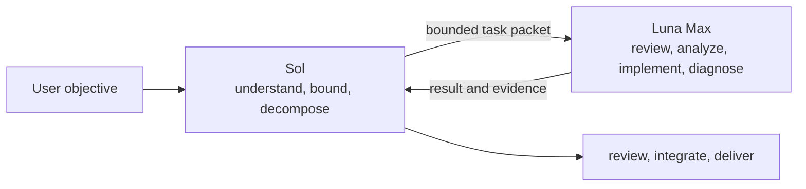

<div align="center">
  <h1>Sol + Luna Codex Workflow</h1>
  <p><strong>Sol owns objectives and judgment. Luna Max executes bounded subtasks.</strong></p>
  <p>An agent-deployable Codex orchestration package with first-principles limits on over-programming and over-testing.</p>
  <p>
    <a href="README.md">简体中文</a> ·
    <strong>English</strong> ·
    <a href="CHANGELOG.md">Changelog</a>
  </p>
  <p>
    <a href="https://github.com/liuyejinghong/sol-luna-codex-workflow/tags"></a>
    <a href="https://github.com/liuyejinghong/sol-luna-codex-workflow/stargazers"></a>
  </p>
</div>

## Quickstart

The recommended path is to give the repository directly to Codex. Its `AGENTS.md` limits the installation scope, and the installer refuses to overwrite different content.

```text
Install https://github.com/liuyejinghong/sol-luna-codex-workflow for my Codex user profile.
Read and follow the repository AGENTS.md first. Preserve my existing Codex configuration
and do not overwrite conflicts. Verify luna_worker and the sol-luna-workflow Skill after
installation, then tell me which manual steps remain.
```

You can also install it yourself:

```bash
git clone https://github.com/liuyejinghong/sol-luna-codex-workflow.git
cd sol-luna-codex-workflow
bash scripts/install.sh
```

The installer writes:

```text
~/.codex/agents/luna-worker.toml
~/.agents/skills/sol-luna-workflow/SKILL.md
```

Then open Codex App **Settings → Personalization → Custom Instructions** and paste one complete language block from [`personalization.md`](personalization.md). This step is manual: a GitHub file or `AGENTS.md` cannot replace the App's account-level personalization setting. A restart is normally unnecessary; start a new task to verify the workflow.

## How it works



Sol stays in the main thread with the full objective and cross-task context. It owns ambiguity, tradeoffs, architecture, decomposition, and final acceptance. Luna Max receives only independently completable, objectively reviewable packets with explicit write ownership. It cannot redefine the parent objective or expand its own scope.

The user does not need to request a subagent every time. Sol may dispatch `luna_worker` when the task satisfies the delegation contract; for tiny tasks where handoff costs more than execution, Sol completes the work directly.

| Delegate to Luna Max | Keep with Sol |
|---|---|
| Read-only code review | Ambiguous or changing requirements |
| Single-module analysis | Architecture and priority decisions |
| Implementation with isolated ownership | Shared state or overlapping writes |
| Focused test diagnosis | Cross-task integration and final judgment |
| Structured information extraction | Releases, accounts, and external side effects |

Parallelism is optional. Use it only when subtasks are independent, context can be compressed, and write ownership does not overlap. Otherwise run the work sequentially.

## What Luna receives

Sol performs the decomposition; Luna does not discover its own assignment. A worker packet contains:

```text
Objective:
Scope and owned paths:
Relevant facts:
Non-goals:
Acceptance criteria:
Verification:
Stop condition:
Return format:
```

If the packet is insufficient, Luna reports the exact blocker. Sol checks the evidence against the parent objective, resolves conflicts, and integrates the output.

## Why Sol + Luna Max

The lead and worker carry different kinds of context. Sol retains goals, constraints, and judgment. Luna receives only the current execution packet. This reduces main-thread context pollution and prevents a smaller model from reinterpreting an ambiguous assignment.

The [DeepSWE v1.1 cost leaderboard](https://deepswe.datacurve.ai/) provides one public reference for choosing Luna Max. In the snapshot updated July 25, 2026, Luna Max scored 67% at an average reported cost of $0.61 per task, showing a strong cost/result balance on that benchmark. This is one benchmark, not proof that Luna Max is universally best.

[](https://deepswe.datacurve.ai/)

The topology does not assume that Luna can handle every task. Sol first absorbs ambiguity, then hands over a complete and reviewable outcome unit. Once a task meets that delegation contract, Sol uses the named `luna_worker` without repeating model-tier selection.

## Constrain decisions, not the workflow

Many engineering Skills improve consistency through spec-first development, TDD, or fixed review sequences. Those methods are not inherently wrong. As model abstraction, reasoning, and tool use improve, however, a heavy process can become the task itself: the model creates more abstractions, tests, reviewers, and tools to satisfy the workflow while moving away from the original problem.

This repository does not mandate a development process. It requires the agent to establish the final objective, invariant facts, minimum acceptance criteria, and authorization boundary, then choose the shortest direct path that can be verified. TDD, specs, and extra tools remain available, but they must first answer:

```text
What concrete irreversible risk does this protect?
What decision changes if it fails?
Why is the existing cheaper evidence insufficient?
```

The constraint came from a real retrospective: a small task ran for more than five hours, while roughly forty minutes changed the intended behavior. Most of the remaining time expanded tests and validation tools, then repaired problems created by those tools. The default is therefore one focused contract check plus one real-path result check. If verification starts serving only the verification layer, return to the original objective.

## Observed usage

This is my live Codex model usage. It shows the token split between Sol and Luna after adopting this working pattern. The feed covers my account-wide activity, so it does not prove that every Luna token was triggered by this repository.

[](https://tokens.ci/u/liuyejinghong)

## Configuration map

Decomposition belongs to the Skill, not the worker profile. Each layer has one responsibility:

| File | Responsibility |
|---|---|
| [`personalization.md`](personalization.md) | Tells Codex when to use this working pattern |
| [`skills/sol-luna-workflow/SKILL.md`](skills/sol-luna-workflow/SKILL.md) | Defines Sol's decomposition, delegation, isolation, review, and integration |
| [`agents/luna-worker.toml`](agents/luna-worker.toml) | Pins the Luna Max worker and bounds its execution |
| [`scripts/install.sh`](scripts/install.sh) | Performs safe installation and legacy-path migration |
| [`AGENTS.md`](AGENTS.md) | Defines the installing Agent's authorization contract |
| [`VERSION`](VERSION) | Records the current semantic version |
| [`CHANGELOG.md`](CHANGELOG.md) | Records concise release history |

`SKILL.md` remains in English as the single model-facing execution contract, avoiding drift between translated rule sets. Its language does not determine the conversation language; the Agent still follows the user and project `AGENTS.md`.

## Installation safety and compatibility

The installer preflights the Agent target, current Skill path, and legacy Skill path. If any location contains different content, it exits before writing. It does not modify `config.toml`, other agents or Skills, global `~/.codex/AGENTS.md`, or Codex App settings.

The legacy `~/.codex/skills/sol-luna-workflow/SKILL.md` is migrated only when it exactly matches the repository and neither it nor its directory is a symbolic link. When `CODEX_HOME` is set, the Agent uses that directory; the Skill still installs to the official user path at `~/.agents/skills`.

This is a community workflow, not an official OpenAI preset. Model availability, routing, and permissions depend on the Codex version and account. After installation, delegate one small read-only task with an obvious answer. Confirm that subagent metadata reports `gpt-5.6-luna` with `max` effort and that the result stays in scope. Textual self-identification is not routing evidence.

## References

| Topic | Source |
|---|---|
| Codex subagents and custom agents | [OpenAI Developers](https://developers.openai.com/codex/agent-configuration/subagents) |
| Codex Skills and discovery paths | [OpenAI Developers](https://developers.openai.com/codex/skills) |
| Codex instruction discovery | [OpenAI Developers](https://developers.openai.com/codex/guides/agents-md) |
| Custom Instructions | [OpenAI Help Center](https://help.openai.com/en/articles/8096356-chat-preferences-for-chatgpt) |
| Codex configuration schema | [OpenAI Developers](https://developers.openai.com/codex/config-schema.json) |
| DeepSWE v1.1 leaderboard | [DataCurve](https://deepswe.datacurve.ai/) |
