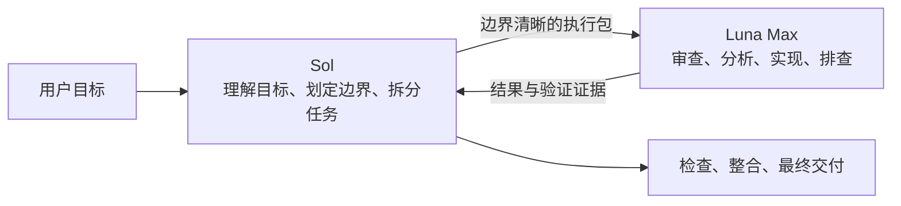

<div align="center">
  <h1>Sol + Luna Codex Workflow</h1>
  <p><strong>Sol 管理目标与判断，Luna Max 执行边界清晰的子任务。</strong></p>
  <p>一套可直接交给 Codex 安装的主从代理工作流，并用第一性原理限制过度编程和过度测试。</p>
  <p>
    <strong>简体中文</strong> ·
    <a href="README.en.md">English</a> ·
    <a href="CHANGELOG.md">更新日志</a>
  </p>
  <p>
    <a href="https://github.com/liuyejinghong/sol-luna-codex-workflow/tags"></a>
    <a href="https://github.com/liuyejinghong/sol-luna-codex-workflow/stargazers"></a>
  </p>
</div>

## 快速开始

推荐把仓库地址直接交给 Codex。仓库中的 `AGENTS.md` 会限制安装范围，安装器遇到不同内容时不会覆盖。

```text
请为我的 Codex 用户配置安装 https://github.com/liuyejinghong/sol-luna-codex-workflow 。
先读取并遵守仓库里的 AGENTS.md，保留现有 Codex 配置，遇到冲突不要覆盖。
安装后验证 luna_worker 和 sol-luna-workflow Skill，并告诉我还需要完成哪些人工步骤。
```

也可以自己安装：

```bash
git clone https://github.com/liuyejinghong/sol-luna-codex-workflow.git
cd sol-luna-codex-workflow
bash scripts/install.sh
```

安装器会写入：

```text
~/.codex/agents/luna-worker.toml
~/.agents/skills/sol-luna-workflow/SKILL.md
```

最后打开 Codex App 的“设置 → 个性化 → 自定义指令”，从 [`personalization.md`](personalization.md) 复制一个完整语言块。这个步骤需要人工完成；GitHub 文件和 `AGENTS.md` 不能替代 App 的账号级个性化设置。通常不需要重启，建议新建一个任务验证工作流。

## 工作方式



Sol 始终留在主线程，保留完整目标和跨任务上下文。它负责处理模糊性、权衡、架构判断、任务拆分和最终验收。Luna Max 只接收能够独立完成、客观检查、写入范围明确的执行包，不重新定义整体目标，也不自行扩大范围。

用户不需要每次显式要求“使用子代理”。任务满足委派合同时，Sol 可以直接调用 `luna_worker`；任务很小、交接成本更高时，则由 Sol 直接完成。

| 适合交给 Luna Max | 应留在 Sol |
|---|---|
| 只读代码审查 | 模糊或持续变化的需求 |
| 单个模块分析 | 全局架构和优先级判断 |
| 写入范围独立的实现 | 共享状态或重叠写入 |
| 聚焦测试排查 | 跨任务整合与最终结论 |
| 结构化信息整理 | 发版、账号和外部副作用 |

并行只是可选手段。只有子任务相互独立、上下文可以压缩、写入范围不重叠时才并行；否则按顺序执行。

## Luna 收到什么

任务拆分由 Sol 完成，Luna 不负责发现自己的工作范围。一个执行包至少包含：

```text
目标：
范围和拥有的路径：
必要事实：
不做事项：
验收标准：
验证方式：
停止条件：
回传格式：
```

如果执行包不足以完成任务，Luna 应返回准确的阻塞点。Sol 根据整体目标检查证据、解决冲突并整合输出。

## 为什么选择 Sol + Luna Max

主线程和 worker 承担的是两类工作。Sol 的上下文用于保存目标、约束和判断；Luna 的上下文只包含当前执行包。这样可以减少主线程污染，也能避免小模型在模糊任务中重新解释需求。

[DeepSWE v1.1 成本榜](https://deepswe.datacurve.ai/)提供了一份选择 Luna Max 的公开参考。在 2026-07-25 的榜单快照中，Luna Max 得分 67%，单任务平均报告成本为 0.61 美元，呈现了较好的成本与效果平衡。这只是单项基准证据，不代表 Luna Max 在所有任务上都绝对最优。

[](https://deepswe.datacurve.ai/)

这套组合的前提不是“Luna 什么都能做”，而是 Sol 先消化模糊性，再把完整、可验收的结果单元交给 Luna。满足委派合同时，Sol 直接使用具名的 `luna_worker`，不需要每次重新比较模型档位。

## 不规定流程，只约束工作方式

许多工程 Skill 通过 spec-first、TDD 或固定审查轮次提高一致性。这些方法本身没有问题，但当模型的抽象、推理和工具能力增强时，过重的流程也可能反过来成为任务目标：模型为了满足流程继续生成抽象、测试、审查器和工具，工作量逐渐离开原始问题。

这个仓库不规定必须采用哪种开发流程。它要求先明确最终目标、不可变事实、最小验收标准和授权边界，再选择最短、最直接、可验证的方案。TDD、spec 和额外工具仍然可以使用，但要先回答：

```text
它保护什么具体且不可逆的风险？
如果失败，会改变什么决策？
为什么现有的更便宜证据不足？
```

这条约束来自一次真实复盘：一个小任务持续了五个多小时，真正改变目标行为的工作约四十分钟，其余时间主要用于扩建测试和验证工具，再修复这些工具产生的新问题。默认验证因此保持为“一次聚焦合同检查 + 一次真实链路结果核对”；如果验证开始只为验证工具本身服务，就回到原始目标。

## 实际使用情况

下面是我的 Codex 实时模型用量，可以观察采用这套工作方式后 Sol 与 Luna 的 token 分布。它统计的是账号总体使用记录，不能证明每一个 Luna token 都由本仓库触发。

[](https://tokens.ci/u/liuyejinghong)

## 配置分工

任务拆解逻辑属于 Skill，不属于 worker 配置。每一层只保留一种职责：

| 文件 | 职责 |
|---|---|
| [`personalization.md`](personalization.md) | 告诉 Codex 何时采用这套工作方式 |
| [`skills/sol-luna-workflow/SKILL.md`](skills/sol-luna-workflow/SKILL.md) | 定义 Sol 的拆分、委派、隔离、验收和整合 |
| [`agents/luna-worker.toml`](agents/luna-worker.toml) | 固定 Luna Max worker，并限制执行边界 |
| [`scripts/install.sh`](scripts/install.sh) | 安全安装与旧路径迁移 |
| [`AGENTS.md`](AGENTS.md) | Agent 部署仓库时的授权合同 |
| [`VERSION`](VERSION) | 当前语义化版本 |
| [`CHANGELOG.md`](CHANGELOG.md) | 简明版本记录 |

`SKILL.md` 保持英文，作为唯一的模型侧执行合同，避免维护两份规则造成漂移。Skill 的语言不会决定对话语言，Agent 仍然遵循用户和项目 `AGENTS.md` 的语言要求。

## 安装边界与兼容性

安装器会先检查 Agent、新 Skill 路径和旧 Skill 路径。任一位置存在不同内容时，它会在写入前退出，不修改 `config.toml`、其他 Agent、其他 Skill、全局 `~/.codex/AGENTS.md` 或 Codex App 设置。

旧路径 `~/.codex/skills/sol-luna-workflow/SKILL.md` 只有在内容与仓库完全一致且不是符号链接时才会迁移。设置 `CODEX_HOME` 时，Agent 使用该目录；Skill 仍安装到官方用户目录 `~/.agents/skills`。

这是一套社区工作流，不是 OpenAI 官方预设。模型可用性、实际路由和权限取决于 Codex 版本与账号。安装后选择一个答案明确、只读的小任务，确认子代理元数据为 `gpt-5.6-luna`、推理强度为 `max`，并检查结果没有越界。模型在文本中自称“我是 Luna”不能证明实际路由。

## 参考资料

| 主题 | 来源 |
|---|---|
| Codex 子代理和自定义 Agent | [OpenAI Developers](https://developers.openai.com/codex/agent-configuration/subagents) |
| Codex Skills 与发现路径 | [OpenAI Developers](https://developers.openai.com/codex/skills) |
| Codex 指令发现顺序 | [OpenAI Developers](https://developers.openai.com/codex/guides/agents-md) |
| Custom Instructions | [OpenAI Help Center](https://help.openai.com/en/articles/8096356-chat-preferences-for-chatgpt) |
| Codex 配置 Schema | [OpenAI Developers](https://developers.openai.com/codex/config-schema.json) |
| DeepSWE v1.1 榜单 | [DataCurve](https://deepswe.datacurve.ai/) |
